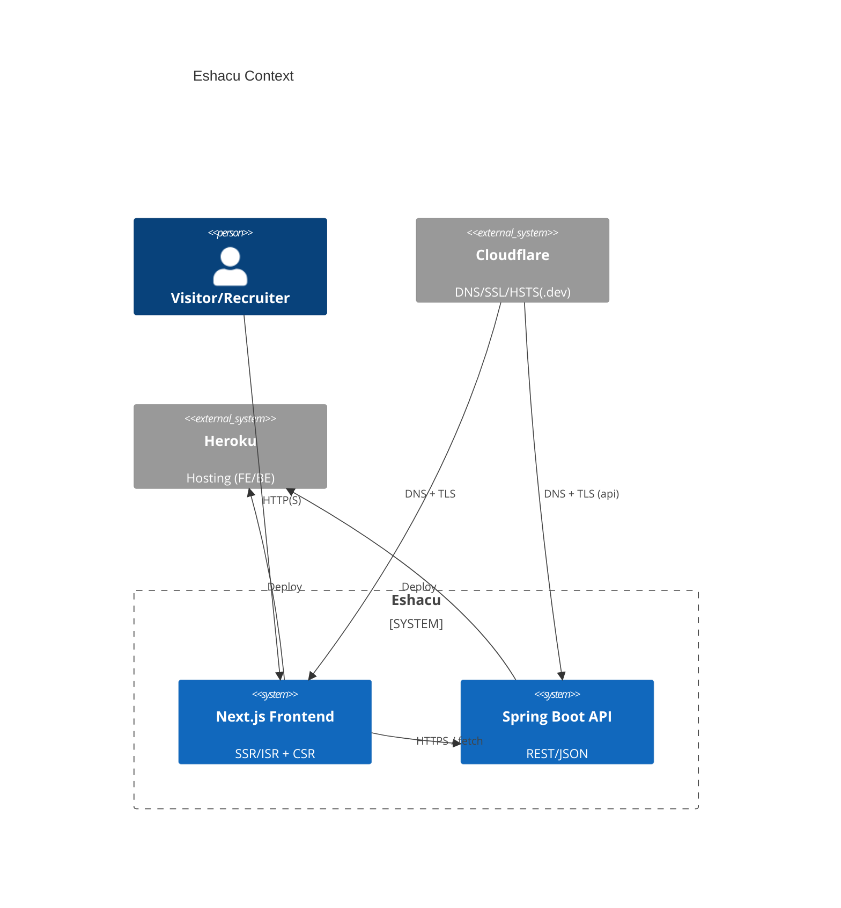
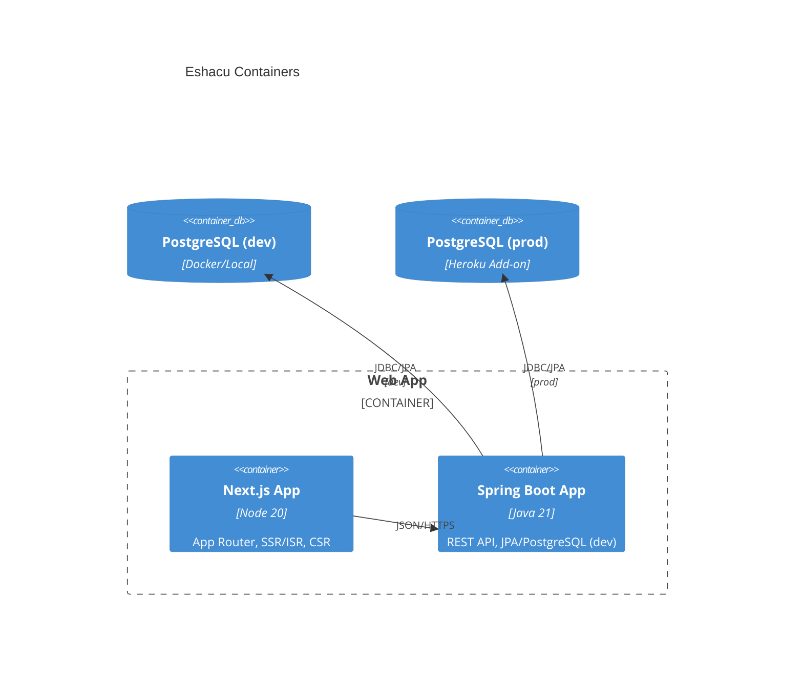
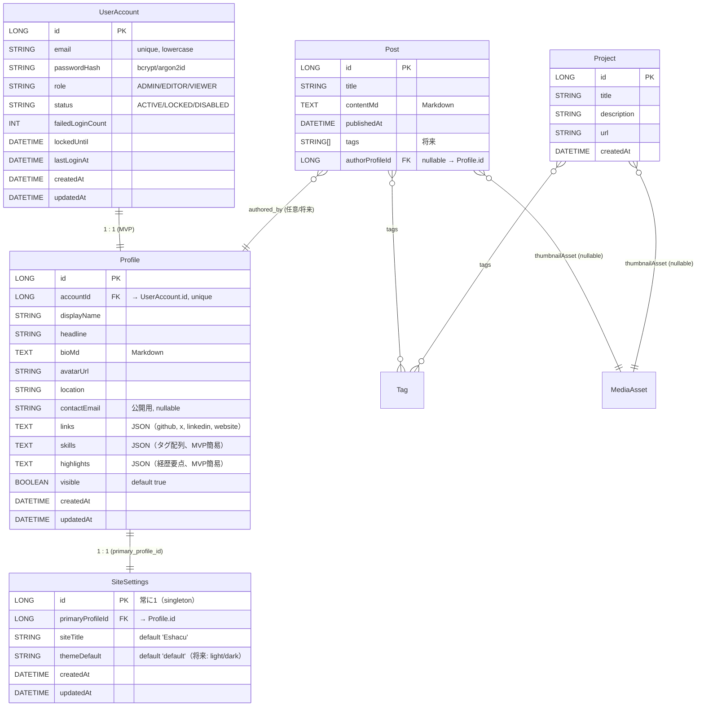

# Eshacu 基本設計書

> 目的: 要件定義の確定事項をもとに、**MVP 実装に直結**する設計を提示する。

---

## 0. メタ & 運用

- **版/日付**: 2025-08-13 (JST)
 - **編集**: Natsuki Ito / ChatGPT
 - **参照**: requirements-definition.md, specs-outline.md, idea-note.md, mvp-task-list.md
 

---

## 1. アーキテクチャ指針（要旨）

- **レンダリング戦略**: 初期描画は SSR/ISR、以後は CSR（SPA 的遷移）。
- **MVP スコープ**: Home／プロフィール／プロジェクト一覧／ブログ一覧・詳細、デフォルトテーマ（白 + #007BFF）と**控えめ**な背景装飾アニメ。
- [非MVP] 将来の機能: テーマ切替（ライト/ダーク）、管理 UI、検索/タグ、監視高度化、Docker 化 など。

---

## 2. システム構成（C4）

### 2.1 コンテキスト図（C4-L1）



### 2.2 コンテナ図（C4-L2）



### 2.3 デプロイ/環境

| 層       | 環境   | 主要要素               | 備考                            |
| ------- | ---- | ------------------ | ----------------------------- |
| FE      | Dev  | Next.js + pnpm     | `pnpm dev`、環境変数 `.env.local`  |
| FE      | Prod | Heroku Node        | `next build && next start`    |
| BE      | Dev  | Spring Boot 3 (PostgreSQL) | `./mvnw spring-boot:run`      |
| BE      | Prod | Heroku Java        | `SPRING_PROFILES_ACTIVE=prod` |
| DNS/SSL | Prod | Cloudflare         | `.dev` は HSTS 既定、Always HTTPS |

[要決定] Staging 環境／Edge キャッシュ方針。

### 2.4 ネットワーク & ドメイン

- ルート: `eshacu.dev`。 [要決定] `www.eshacu.dev` リダイレクトの要否。
- API: `api.eshacu.dev`（Heroku BE へ CNAME/ALIAS）とする。
- Cloudflare: SSL/TLS = Full、`Always Use HTTPS` を有効。
- CORS: `localhost:3000 ↔ 8080` を dev で許可。prod は `NEXT_PUBLIC_API_BASE=https://api.eshacu.dev`。

---

## 3. データ設計（論理）

### 3.1 目的と分離方針

- 認証情報（非公開）と公開プロフィール（公開）を**明確分離**する。
- サイト所有者は**単一**を前提とする（正規化は過度に行わない）。
- **対象エンティティ（MVP）**: `UserAccount`（認証）, `Profile`（公開プロフィール）, `SiteSettings`（サイト設定）, `Project`, `Post`, `Tag`, `MediaAsset`。
- [非MVP] 複数著者対応時は `Post.authorProfileId` を **nullable** として採用する。

### 3.2 ER 図（論理）



### 3.3 型/制約 [要決定]

#### UserAccount

| フィールド               | 型           | 必須 | 制約/備考                        |
| ------------------- | ----------- | -- | ---------------------------- |
| id                  | Long        | ✓  | PK, Auto                     |
| email               | String(255) | ✓  | **Unique**（小文字化）             |
| passwordHash        | String(120) | ✓  | `bcrypt` or `argon2id`       |
| role                | Enum        | ✓  | `ADMIN`/`EDITOR`/`VIEWER`    |
| status              | Enum        | ✓  | `ACTIVE`/`LOCKED`/`DISABLED` |
| failedLoginCount    | Int         | ✓  | 0 初期                         |
| lockedUntil         | DateTime    |    | 連続失敗ロック解除時刻                  |
 
| lastLoginAt         | DateTime    |    |                              |
| createdAt/updatedAt | DateTime    | ✓  | 監査                           |

#### Profile

| フィールド               | 型           | 必須 | 制約/備考                              |
| ------------------- | ----------- | -- | ---------------------------------- |
| id                  | Long        | ✓  | PK, Auto                           |
| accountId           | Long        | ✓  | **Unique FK**（1:1）                 |
| displayName         | String(100) | ✓  | 例: “Natsuki Ito”                   |
| headline            | String(160) |    | 例: “Java/Spring Boot Developer”    |
| bioMd               | Text        |    | Markdown 本文                        |
| avatarUrl           | String(300) |    |                                    |
| location            | String(120) |    |                                    |
| contactEmail        | String(255) |    | 公開用メール（任意）                         |
| links               | Text(JSON)  |    | `{ "github": "..." }` 等            |
| skills              | Text(JSON)  |    | `["Java","Spring Boot","Next.js"]` |
| highlights          | Text(JSON)  |    | 実績・略歴カード用                          |
| visible             | Bool        | ✓  | 既定 true                            |
| createdAt/updatedAt | DateTime    | ✓  | 監査                                 |

#### SITE\_SETTINGS（singleton）

| フィールド               | 型           | 必須 | 制約/備考                         |
| ------------------- | ----------- | -- | ----------------------------- |
| id                  | Long        | ✓  | 常に `1`（アプリで保証）                |
| primaryProfileId    | Long        | ✓  | FK → `Profile.id`             |
| siteTitle           | String(120) | ✓  | 例: “Eshacu”                   |
| themeDefault        | String(20)  | ✓  | 既定は `default`。 [非MVP] `light`/`dark` を追加採用可 |
| createdAt/updatedAt | DateTime    | ✓  | 監査                            |

注: 配色はフロントエンドのテーマ（CSS変数）で管理し、DBには色を保持しない。

#### Project / Post（既存に準拠、差分のみ追記）

| DB-ID  | エンティティ  | フィールド           | 型（論理）       | 制約/備考                          |
| ------ | ------- | --------------- | ----------- | ------------------------------ |
| DB-001 | Project | id              | Long        | Auto                           |
|        |         | slug            | String(160) | **Unique**（URL キー、英小文字/ハイフン） |
|        |         | title           | String(120) | NotNull                        |
|        |         | description     | String(500) |                                |
|        |         | url             | String(300) | URL 形式                         |
|        |         | status          | Enum        | `PLANNING`/`IN_PROGRESS`/`COMPLETED`/`ON_HOLD` |
| DB-002 | Post    | id              | Long        | Auto                           |
|        |         | slug            | String(160) | **Unique**（URL キー、英小文字/ハイフン） |
|        |         | title           | String(160) | NotNull                        |
|        |         | contentMd       | Text        | Markdown 原本                    |
|        |         | status          | Enum        | `DRAFT`/`PUBLISHED`/`ARCHIVED` |
|        |         | publishedAt     | DateTime(UTC) | 公開基準に使用                     |
|        |         | authorProfileId | Long        | nullable, FK→Profile.id        |

#### Tag / MediaAsset / Join（新規）

| DB-ID  | エンティティ     | フィールド       | 型（論理）   | 制約/備考                                  |
| ------ | ------------ | ------------- | --------- | ---------------------------------------- |
| DB-060 | Tag          | id            | Long      | Auto                                     |
|        |              | slug          | String(160)| **Unique**                               |
|        |              | name          | String(160)| NotNull                                  |
| DB-061 | PostTag      | postId        | Long      | FK→Post.id, かつ `(postId,tagId)` Unique     |
|        |              | tagId         | Long      | FK→Tag.id                                 |
| DB-062 | ProjectTag   | projectId     | Long      | FK→Project.id, かつ `(projectId,tagId)` Unique |
|        |              | tagId         | Long      | FK→Tag.id                                 |
| DB-070 | MediaAsset   | id            | Long      | Auto                                     |
|        |              | kind          | Enum      | `IMAGE`/`FILE`/`VIDEO`                   |
|        |              | storageKey    | String(300)| **Unique**（またはURL）                     |
|        |              | mimeType      | String(100)|                                          |
|        |              | bytes         | Long      |                                          |
|        |              | width/height  | Int       | 画像時のみ使用（null可）                         |
|        |              | hash          | String(100)| Unique（任意、重複排除）                        |
|        |              | createdAt/... | DateTime  |                                          |

### 3.4 インデックス/制約（要点）

- `user_account.email`：Unique Index。
- `profile.accountId`：Unique Index（1:1 拘束）。
- `site_settings.id = 1` をアプリで固定作成。`primaryProfileId` は FK。
- `Tag.slug`：Unique。
- `MediaAsset.kind`, `MediaAsset.createdAt` に Index。
- `Project.slug`, `Post.slug`：Unique Index。
- 公開条件用 Index：`idx_post_publish(status, publishedAt DESC, id DESC)`、`idx_project_publish(status, publishedAt DESC, id DESC)`。
- 多対多結合：`post_tags(postId, tagId)` と `project_tags(projectId, tagId)` に一意制約＋参照用 Index（例：`idx_post_tags_tag_post` / `idx_project_tags_tag_project`）。

公開条件（ルール）
- `status=PUBLISHED` かつ `publishedAt(UTC) <= now` のもののみ Public API で公開。管理APIではドラフト参照可。

注記（時刻）
- 本書の DateTime は実装上 `Instant`（UTC）で保持・返却するものとする。

### 3.5 シード（MVP）

1. `user_account` に `ADMIN` を1件作成（メール/初期パスワード）。
2. `profile` を同 `accountId` で作成。
3. `site_settings`（id=1）に `primaryProfileId` を設定。

### 3.6 セキュリティ注意（データ設計観点）

- 認証系（`UserAccount`）と公開系（`Profile`）で **DTO も分離**。
- 機微情報は **暗号化 at-rest**。
- `Profile.visible=false` でドラフト非公開制御。

**リード（未確定）**: 物理設計（DDL/Flyway）、インデックス詳細、マイグレーション方針。

## 4. API 設計（概要）

### 4.1 エンドポイント一覧（MVP）

| API-ID  | Method | Path              | 概要           | 認可                   |
| ------- | ------ | ----------------- | ------------ | -------------------- |
| API-001 | GET    | `/api/hello`      | ヘルスチェック      | Public               |
| API-002 | GET    | `/api/projects`   | プロジェクト一覧     | Public               |
| API-003 | GET    | `/api/posts`      | 記事一覧         | Public               |
| API-004 | GET    | `/api/posts/{slug}` | 記事詳細         | Public               |
| API-005 | GET    | `/api/profile`    | 公開プロフィール（単一） | Public               |
| API-101 | POST   | `/api/admin/...`  | 簡易管理操作       | Basic/Token（MVP 最低限） |

- [非MVP] Project の詳細 API を追加する場合、識別子は `{slug}` を採用する。

### 4.2 共通仕様（レスポンス/エラー）

- **Content-Type**: `application/json; charset=UTF-8`
- **一覧レスポンス**: `PageResponse<T>` を採用（`{ items, page, pageSize, totalRecords }`）。`?page=&size=` を受け付け、既定は `page=0,size=20`。
- **エラー**: RFC7807（`application/problem+json`）に準拠し、`type/title/status/detail/instance` を返却。

例（404 Not Found）

```json
{
  "type": "about:blank",
  "title": "Not Found",
  "status": 404,
  "detail": "post not found",
  "instance": "/api/posts/nonexistent-slug"
}
```

### 4.3 スキーマ例（概要）

```json
// Project
{
  "id": 1,
  "title": "Personal Website",
  "description": "Portfolio and blog",
  "url": "https://eshacu.dev/projects/1"
}
```

```json
// Post
{
  "id": 10,
  "title": "Next.js SSR/ISR Basics",
  "contentMd": "# Hello... (Markdown)",
  "publishedAt": "2025-08-01T12:00:00Z",
  "authorProfileId": 1
}
```

```json
// Profile (GET /api/profile)
{
  "displayName": "Natsuki Ito",
  "headline": "Java/Spring Boot Developer",
  "bioMd": "自己紹介のMarkdown...",
  "avatarUrl": "https://.../avatar.png",
  "location": "Tokyo, JP",
  "contactEmail": "contact@example.com",
  "links": { "github": "https://github.com/...", "x": "https://x.com/...", "website": "https://eshacu.dev" },
  "skills": ["Java", "Spring Boot", "Next.js"],
  "highlights": [ {"title":"個人サイトEshacu","year":2025} ]
}
```

**API 仕様（OpenAPI）**: springdoc-openapi を採用し、API 仕様の SSOT とする。`/v3/api-docs`（JSON）を提供し、`/swagger-ui` で可視化する。運用方針: グループは `public`/`admin` を使用し、dev では両方を有効、prod では `/swagger-ui` と `/v3/api-docs` を無効（必要時は内部利用のみ一時的に JSON を許可）。エラーコード表、Rate Limit は今後詳細化。

---

## 5. 画面設計（IA/ワイヤ）

### 5.1 画面一覧（MVP）

| UI-ID  | ルート           | 目的       | 備考              |
| ------ | ------------- | -------- | --------------- |
| UI-001 | `/`           | Home（導線） | Hero／最新記事カード    |
| UI-002 | `/profile`    | プロフィール   | 自己紹介／スキル要点      |
| UI-003 | `/projects`   | プロジェクト一覧 | カード／外部リンク       |
| UI-004 | `/posts`      | 記事一覧     | リスト（タイトル/日付）    |
| UI-005 | `/posts/[slug]` | 記事詳細     | Markdown レンダリング |

### 5.2 レイアウト/遷移

- App Router（Next.js）。初回は SSR/ISR、以降は CSR 遷移（`next/link`）。
- 共通: Header（ナビ）/ Main / Footer。スケルトンローディングとエラーバウンダリは共通化。

### 5.3 テーマ/背景（MVP）

- **デフォルト配色**: 白 + `#007BFF`（アクセント）。
- **背景装飾**: `"＋"` 記号を規則配置し**ゆっくり回転**（CSS または Canvas/Three.js）。
- **パフォーマンス**: 60fps 固定は不要。CPU/GPU 負荷の低い値で滑らかさを優先。
- [非MVP] テーマ切替（ライト/ダーク）は UI と LocalStorage 保存を採用する（MVP では未実装）。

### 5.4 スタイル基盤（抜粋）

```css
:root{
  --color-bg:#ffffff;
  --color-text:#0f172a; /* slate-900 */
  --color-accent:#007BFF;
}
```

**リード（未確定）**: コンポーネント粒度の Props/State 定義、A11y チェック表。

---

## 6. セキュリティ設計（概要）

- **通信**: `.dev` の HSTS により常時 HTTPS。Cloudflare Universal SSL 使用。
- **CORS**: dev では `http://localhost:3000` を許可。prod は `https://eshacu.dev`／`https://api.eshacu.dev` 間で最小許可。
- **管理 API**: MVP は Token（固定値, 32+bytes）で保護し、`ADMIN_API_ENABLED=false` を既定（無効時は404）。[非MVP] 認証/認可（Session/Cookie）を採用する。
- **管理 API ハードニング（A案）**: CORS 非許可（同一オリジン）、IP/WAF 制限推奨、5–10 req/min/IP のレート制限、監査ログ（成功/失敗/429, IP/UA, トークンはマスク）。
- **ヘッダ**: `X-Content-Type-Options: nosniff` / `Referrer-Policy` を必須とする。 [非MVP] `Content-Security-Policy` を採用する。

---

## 7. 観測性（最小）

- BE: `/actuator/health`（200 で生存）、簡易アクセスログ。
- FE: [非MVP] Web Vitals ／ [非MVP] エラーログ収集。

**リード（未確定）**: SLI/SLO、通知、ダッシュボード。

---

## 8. 性能・容量目標（NFR 反映）

- API P95 < 100ms（ヘルスと主要 GET）。
- 初期描画 SSR/ISR P75 < 200ms とする。
- 背景アニメは入力/スクロール遅延を**感じさせない**レベル。

---

## 9. トレーサビリティ（骨子／MVP）

| REQ         | 関連 UI      | 関連 API      | 主要タスク                              |
| ----------- | ---------- | ----------- | ---------------------------------- |
| REQ-001     | UI-001     | -           | FE: レイアウト/トップ（#12, #29）            |
| REQ-002     | UI-002     | API-005     | FE: プロフィール表示／BE: `/api/profile` 実装 |
| REQ-003     | UI-003     | API-002     | BE: `/api/projects`（#29）           |
| REQ-004     | UI-004/005 | API-003/004 | FE/BE: 記事一覧・詳細（#29）                |
| REQ-006     | ルーティング     | -           | FE: CSR 遷移（#12）                    |
| REQ-008/009 | UI-共通      | -           | FE: 背景装飾/テーマ（#13）                  |

---

## 10. リスク & 管理（設計観点）

- Cloudflare×Heroku の SSL 二重化による混在/失効 → DNS only/Proxy の使い分けガイド整備。
- 無料枠性能のばらつき → ISR 更新間隔/キャッシュ方針を設計に反映。
- アニメの視認性低下 → 強度/不透明度/速度のレビュー（A/B）

---

## 11. 付録

### 11.1 実装スキャフォールド（抜粋）

- **backend**: Spring Boot 3 / Java 21 / JPA/PostgreSQL（dev）
- **frontend**: Next.js 15 / TypeScript / App Router / pnpm
- **CI**: GitHub Actions（`./mvnw test`, `pnpm lint`）

### 11.2 今後の詳細化 TODO

-

---

## 12. 変更履歴（ChangeLog）

- **v0.1 (2025-08-13)**: 初版。MVP 実装に必要な基本設計を確定。
- **v0.1 追補 (2025-08-13)**: 認証/プロフィール/サイト設定のデータ設計を追加。`/api/profile` を定義。トレーサビリティ更新。
- **v0.1 追補 (2025-08-30)**: ADMIN_PROFILE を PROFILE に改称。Tag/MediaAsset を追加し、Post/Project との関係（多対多/多対一）、インデックス/制約を追記。
