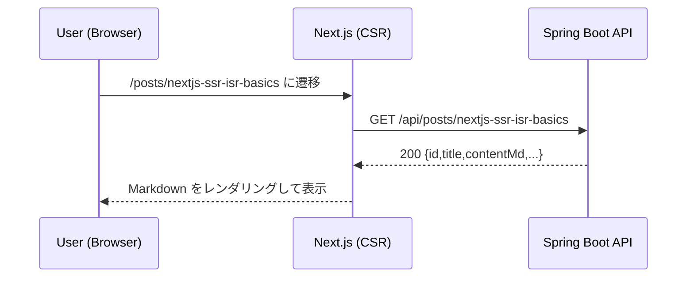
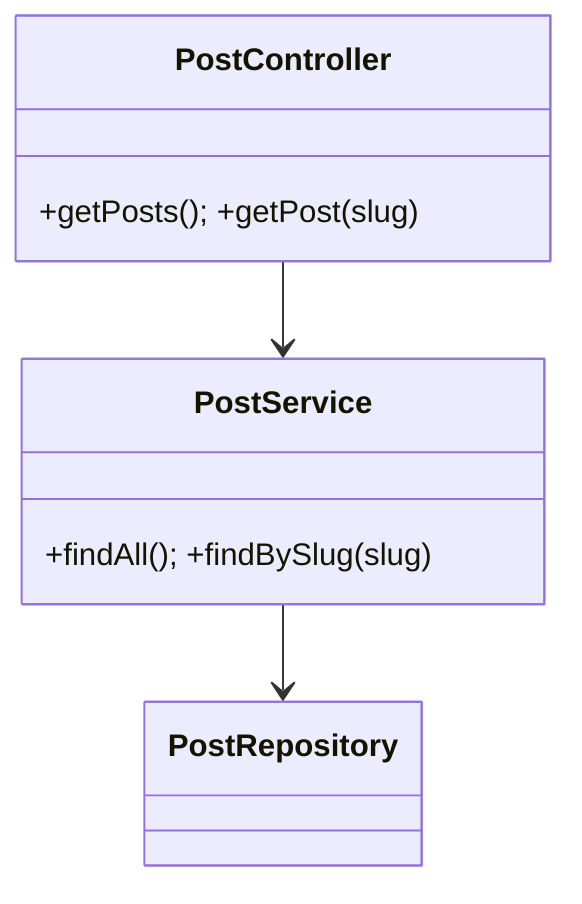

# Eshacu 詳細設計書


> 目的: `specs-outline.md`（再設計案）、`requirements-definition.md`、`basic-design-definition.md`、`idea-note.md`を統合し、**MVP 実装に直結**する詳細仕様を定義する。

---

## 0. メタ & 運用

- **版/日付**: 2025-08-13 (JST)
- **編集**: Natsuki Ito / ChatGPT
- **参照**: `specs-outline.md`, `requirements-definition.md`, `basic-design-definition.md`, `idea-note.md`, `mvp-task-list.md`
 

---

## 1. 全体方針（詳細設計の前提）

- **レンダリング戦略**: 初期表示は SSR/ISR、以後は CSR（SPA 的遷移）。
- **MVP スコープ**: Home／プロフィール／プロジェクト一覧／ブログ一覧・詳細、デフォルトテーマ（白 + `#007BFF`）＋控えめ背景アニメ。
- **分離方針（データ）**: 認証データ（`UserAccount`）と公開プロフィール（`Profile`）を 1:1 分離。`User` 単一エンティティは **採用しない**（後述 ER 参照）。
- **本章の粒度**: BE/FE の I/O、契約、例外、テスト観点までを **実装直結レベル**で定義する。

---

## 2. モジュール構成（パッケージ/ディレクトリ）

### 2.1 Backend（Spring Boot / Java 21）

```
eshacu-backend/
└─ src/main/java/dev/eshacu/
   ├─ EshacuApplication.java
   ├─ config/        # CORS, Security, Jackson, Swagger(OpenAPI)
   ├─ controller/    # REST Controller (public/admin)
   ├─ dto/           # Request/Response DTO
   ├─ entity/        # JPA Entities (UserAccount 等)
   ├─ repository/    # Spring Data JPA Repositories
   ├─ service/       # ビジネスロジック
   ├─ mapper/        # DTO<->Entity 変換（手動。MapStructは[条件付き]採用）
   ├─ exception/     # 例外クラス、ハンドラ
   └─ util/          # 共通
```

- **命名**: `dev.eshacu.*`（ドメインに合わせる）。
- **例外方針**: `ApiException`（ドメイン例外）/ `ValidationException` / `NotFoundException` 等を用意し、`@ControllerAdvice` で集約。

### 2.2 Frontend（Next.js 15 / TypeScript / App Router）

```
eshacu-frontend/
└─ src/
   ├─ app/                      # ルーティング (app router)
   │  ├─ layout.tsx            # 共通レイアウト
   │  ├─ page.tsx              # Home
   │  ├─ profile/page.tsx
   │  ├─ projects/page.tsx
   │  └─ posts/
   │     ├─ page.tsx           # 記事一覧
   │     └─ [slug]/page.tsx    # 記事詳細
   ├─ components/               # UI コンポーネント
   │  ├─ ui/                    # ボタン/カード等
   │  ├─ posts/                 # PostList/PostCard/PostDetail
   │  ├─ projects/              # ProjectCard
   │  └─ decor/                 # 背景装飾（＋の回転アニメ）
   ├─ lib/
   │  ├─ api-client.ts         # fetch wrapper
   │  ├─ typing.ts             # 型定義（API 契約と対応）
   │  └─ markdown.ts           # Markdown レンダリング
   ├─ styles/
   │  ├─ globals.css
   │  └─ theme.css             # CSS variables（--color-accent 等）
   └─ env.d.ts                 # env 型
```

- [条件付き] **データ取得**: MVP では `fetch` + 軽量ラッパ（`api-client.ts`）を採用する。キャッシュ/再検証などの要件が発生した場合、ADR に基づき React Query/SWR を採用する。
- **アクセシビリティ**: フォーカスリング/コントラストを CSS 変数で担保。

---

## 3. データ設計（物理）

### 3.1 エンティティ一覧（MVP）

| DB-ID  | エンティティ         | 用途               | 備考                 |
| ------ | -------------- | ---------------- | ------------------ |
| DB-010 | USER\_ACCOUNT  | 認証/アカウント状態       | 機微情報。公開 API へ露出しない |
| DB-020 | Profile        | 公開プロフィール（1:1）    | 表示用 JSON の源        |
| DB-030 | SITE\_SETTINGS | サイト設定（singleton） | `id=1` 固定          |
| DB-040 | Project        | プロジェクト一覧         | 既存簡易モデルを拡張         |
| DB-050 | Post           | ブログ記事            | Markdown 本文        |

> 方針: **認証**と**公開**を分離する。 [非MVP] 複数著者対応時は `Post.authorProfileId` を nullable で採用する。

### 3.2 カノニカルフィールド定義（MVP, SSOT反映）

本節は旧SSOT（appendix 配下）を本書へ統合した正式なフィールド定義です。以下を最新の規範とし、以降の古いサンプルは参考扱いとします（appendix は参考/テンプレ/アーカイブ）。

#### Post（ブログ記事） — table: `post`
- 主キー/監査: `id bigserial PK`, `created_at timestamptz`, `updated_at timestamptz`
- 公開: `publish_status varchar(16)`（`DRAFT`/`PUBLISHED`/`ARCHIVED`）, `published_at timestamptz`
- 識別: `slug varchar(160)` UNIQUE（正規表現 `^[a-z0-9-]{1,160}$`、UXインデックス `ux_post_slug`）
- 本文/表示: `title varchar(160)` NOT NULL, `content_md text` NOT NULL
- 関連: タグ多対多は `post_tags(post_id, tag_id)` を使用
- 公開判定（規範）: `publish_status='PUBLISHED' AND published_at<=now()`

#### Project（プロジェクト） — table: `project`
- 主キー/監査: `id bigserial PK`, `created_at timestamptz`, `updated_at timestamptz`
- 公開: `publish_status varchar(16)`, `published_at timestamptz`
- 識別: `slug varchar(160)` UNIQUE（UXインデックス `ux_project_slug`）
- 表示: `title varchar(120)` NOT NULL, `summary varchar(500)` NULL, `content_md text` NULL
- 外部URL: `repo_url varchar(300)` NULL, `app_url varchar(300)` NULL（`https?://` 検証）
- 関連: タグ多対多は `project_tags(project_id, tag_id)` を使用

#### Tag（タクソノミ） — table: `tag`
- 主キー/監査: `id bigserial PK`, `created_at timestamptz`, `updated_at timestamptz`
- 識別: `slug varchar(160)` UNIQUE（UXインデックス `ux_tag_slug`、正規化ルールに従う）
- 表示: `name varchar(160)` NOT NULL, `description text` NULL
- 制約: 1アイテムあたり最大10タグ（アプリ側バリデーション）
- リレーション: `post_tags(post_id, tag_id)`, `project_tags(project_id, tag_id)`

#### 共通ルール（Slug / 公開 / 索引 / リレーション）

- Slug 規約（Post/Project/Tag 共通）
  - 形式: `^[a-z0-9-]{1,160}$`（ASCII 小文字 + ハイフン）。
  - 正規化: 小文字化、空白→`-`、連続 `-` 圧縮、前後 `-` 除去。
  - 一意性: 各テーブル内で一意（クロステーブル一意は不要）。
  - 変更可否: Post/Project は DRAFT 中のみ変更可。Tag は作成後は変更不可（MVP）。
- 公開判定（Post/Project 統一）
  - 公開: `publish_status='PUBLISHED' AND published_at<=now()`
  - 非公開: `publish_status IN ('DRAFT','ARCHIVED') OR published_at IS NULL OR published_at>now()`
  - 既定ソート: `published_at DESC`。
- UXインデックス（ユニーク）
  - 目的: ルーティング（`/posts/{slug}` 等）の 0/1 ルックアップを高速・安定にするため必須。
  - DDL例: `CREATE UNIQUE INDEX ux_post_slug ON post(slug);` / `ux_project_slug` / `ux_tag_slug`。
- 推奨インデックス（一覧最適化）
  - Post: `CREATE INDEX idx_post_publish ON post(publish_status, published_at DESC, id DESC);`
  - Project: `CREATE INDEX idx_project_publish ON project(publish_status, published_at DESC, id DESC);`
- 参照整合性（ON DELETE）
  - `post_tags.post_id` / `project_tags.project_id` → 親削除時に CASCADE（連結行を自動削除）。
  - `post_tags.tag_id` / `project_tags.tag_id` → RESTRICT（参照がある Tag は削除不可）。
  - `site_settings.primary_profile_id` → RESTRICT（存在必須）。
  - （任意）Post/Project のサムネイル等の任意参照は `SET NULL` を推奨。
- 入力上限（アプリ検証）
  - Tag 数: 1アイテム最大 10。重複禁止。
  - URL: `https?://` で開始、最大 300 文字程度。

#### 代表クエリ（タグで記事を絞り込み）

```sql
SELECT p.*
FROM post p
JOIN post_tags pt ON pt.post_id = p.id
JOIN tag t ON t.id = pt.tag_id
WHERE t.slug = $1
  AND p.publish_status = 'PUBLISHED'
  AND p.published_at <= now()
ORDER BY p.published_at DESC
LIMIT $2 OFFSET $3;
```

#### Profile（公開プロフィール） — table: `profile`
- 主キー/監査: `id bigserial PK`, `created_at timestamptz`, `updated_at timestamptz`
- 関係: `account_id bigint UNIQUE NOT NULL`（FK → `user_account.id` の 1:1）
- 表示: 
  - `display_name varchar(100)` NOT NULL
  - `headline varchar(160)` NULL
  - `bio_md text` NULL（Markdown 原本）
  - `avatar_url varchar(300)` NULL
  - `location varchar(120)` NULL
  - `contact_email varchar(255)` NULL
- JSON（MVPはTEXT文字列）: `links_json text`, `skills_json text`, `highlights_json text`
  - ガイド: 各JSONは≈16KB以内、配列件数は links≤20, skills≤50, highlights≤50 を目安。
- 公開制御: `visible boolean NOT NULL DEFAULT true`
- 索引: `UNIQUE(account_id)`（`ux_profile_account_id`）
- 注記: JSONB への移行は将来のマイグレーションで対応。

#### SiteSettings（サイト設定・シングルトン） — table: `site_settings`
- 主キー/監査: `id bigint PK`（シングルトン、運用で id=1 を保持）, `created_at timestamptz`, `updated_at timestamptz`
- 関係: `primary_profile_id bigint NOT NULL`（FK → `profile.id`）
- 表示: `site_title varchar(120)` NOT NULL
- テーマ: `theme_default varchar(20)` NOT NULL DEFAULT 'default'
- 注意: 配色は FE テーマで管理（DBに色は保持しない）。
- 制約例: `CHECK (id = 1)` を採用する場合は開発・移行手順に留意（任意）。

#### UserAccount（認証アカウント） — table: `user_account`
- 主キー/監査: `id bigserial PK`, `created_at timestamptz`, `updated_at timestamptz`, `last_login_at timestamptz NULL`
- 識別: `email varchar(255)` NOT NULL UNIQUE（小文字で保存、UXインデックス `ux_user_email`）
- 機微: `password_hash varchar(120)` NOT NULL（bcrypt/argon2id）
- 権限/状態: `role varchar(16)`（`ADMIN`/`EDITOR`/`VIEWER`）, `status varchar(16)`（`ACTIVE`/`LOCKED`/`DISABLED`）
- ロック制御: `failed_login_count int DEFAULT 0`, `locked_until timestamptz NULL`
- 注記: 2FA は MVP 対象外（将来のマイグレーションで追加）。

---

### 3.2 JPA エンティティ（骨子）

方針（時間の扱い）
- 全ての時刻は `Instant`（UTC）で保持・返却する。アプリ層での表示はクライアント側タイムゾーンで行う。

```java
// entity/UserAccount.java
@Entity @Table(name="user_account")
public class UserAccount {
  @Id @GeneratedValue(strategy=GenerationType.IDENTITY)
  private Long id;
  @Column(nullable=false, unique=true, length=255)
  private String email; // lower-case
  @Column(nullable=false, length=120)
  private String passwordHash; // bcrypt/argon2id
  @Enumerated(EnumType.STRING)
  private Role role; // ADMIN/EDITOR/VIEWER
  @Enumerated(EnumType.STRING)
  private Status status; // ACTIVE/LOCKED/DISABLED
  private Integer failedLoginCount;
  private Instant lockedUntil;
  // 2FA は MVP では未採用。将来導入時にフィールドを追加する。
  private Instant lastLoginAt;
  private Instant createdAt;
  private Instant updatedAt;
}
```

```java
// entity/Profile.java
@Entity @Table(name="profile")
public class Profile {
  @Id @GeneratedValue(strategy=GenerationType.IDENTITY)
  private Long id;
  @OneToOne(optional=false)
  @JoinColumn(name="account_id", unique=true)
  private UserAccount account;
  private String displayName;  // e.g. "Natsuki Ito"
  private String headline;     // optional
  @Lob private String bioMd;   // Markdown
  private String avatarUrl;    // optional
  private String location;     // optional
  private String contactEmail; // public contact, optional
  @Column(columnDefinition="TEXT")
  private String linksJson;    // JSON string (MVP簡易)
  @Column(columnDefinition="TEXT")
  private String skillsJson;   // JSON string (MVP簡易)
  @Column(columnDefinition="TEXT")
  private String highlightsJson; // JSON string (MVP簡易)
  private Boolean visible = true;
  private Instant createdAt;
  private Instant updatedAt;
}
```

方針: 開発/本番とも PostgreSQL を前提とする。JSON は MVP では TEXT で保持し、将来 JSONB へ移行する（Flyway V2 を予定）。

```java
// entity/SiteSettings.java
@Entity @Table(name="site_settings")
public class SiteSettings {
  @Id private Long id = 1L; // singleton
  @OneToOne(optional=false)
  @JoinColumn(name="primary_profile_id")
  private Profile primaryProfile;
  private String siteTitle = "Eshacu";
  private String themeDefault = "default"; // [非MVP] light/dark を追加採用可
  private Instant createdAt;
  private Instant updatedAt;
}
```

```java
// entity/Project.java
@Entity
public class Project {
  @Id @GeneratedValue private Long id;
  @Column(nullable=false, unique=true, length=120)
  private String slug; // URL key (unique)
  private String title;
  private String description;
  private String url;
  @Enumerated(EnumType.STRING)
  private ProjectStatus status; // PLANNING/IN_PROGRESS/COMPLETED/ON_HOLD
  private Instant createdAt;
}
```

```java
// entity/Post.java（タグ/カバー画像の関係を追加）
@Entity
public class Post {
  @Id @GeneratedValue private Long id;
  @Column(nullable=false, unique=true, length=160)
  private String slug; // URL key (unique)
  private String title;
  @Lob private String contentMd; // Markdown (原本)
  @Enumerated(EnumType.STRING)
  private PostStatus status; // DRAFT/PUBLISHED/ARCHIVED
  private Instant publishedAt;
  private Long authorProfileId; // nullable FK
  @ManyToOne(optional=true)
  @JoinColumn(name="thumbnail_asset_id")
  private MediaAsset thumbnailAsset;
  @ManyToMany
  @JoinTable(name = "post_tag",
    joinColumns = @JoinColumn(name = "post_id"),
    inverseJoinColumns = @JoinColumn(name = "tag_id"))
  private Set<Tag> tags;
}

// entity/Project.java（サムネ/タグ追加のイメージ）
@Entity
public class Project {
  @Id @GeneratedValue private Long id;
  private String title;
  private String description;
  private String url;
  private Instant createdAt;
  @ManyToOne(optional=true)
  @JoinColumn(name="thumbnail_asset_id")
  private MediaAsset thumbnailAsset;
  @ManyToMany
  @JoinTable(name = "project_tag",
    joinColumns = @JoinColumn(name = "project_id"),
    inverseJoinColumns = @JoinColumn(name = "tag_id"))
  private Set<Tag> tags;
}
```

// entity/Tag.java（MVP: kindは採用しない）
@Entity @Table(name="tag")
public class Tag {
  @Id @GeneratedValue(strategy=GenerationType.IDENTITY) private Long id;
  @Column(nullable=false, length=160, unique=true) private String slug;
  @Column(nullable=false, length=160) private String name;
  @Column(columnDefinition="TEXT") private String description;
  private Instant createdAt; private Instant updatedAt;
}

// entity/MediaAsset.java
@Entity @Table(name="media_asset")
public class MediaAsset {
  @Id @GeneratedValue private Long id;
  @Enumerated(EnumType.STRING) private MediaKind kind; // IMAGE/FILE/VIDEO
  @Column(nullable=false, unique=true, length=300) private String storageKey;
  private String mimeType; private Long bytes;
  private Integer width; private Integer height; // 画像時に使用（null可）
  private String hash; // 任意Unique（重複排除）
  private Instant createdAt; private Instant updatedAt;
}

// 公開条件（共通ルール）
// Post/Project の公開可否は「publishStatus='PUBLISHED' かつ publishedAt(UTC) <= now」で判定する。

// enum 定義（例）
enum PostStatus { DRAFT, PUBLISHED, ARCHIVED }
enum ProjectStatus { PLANNING, IN_PROGRESS, COMPLETED, ON_HOLD }

### 3.3 リポジトリ（Spring Data JPA）

```java
public interface UserAccountRepository extends JpaRepository<UserAccount, Long> {
  Optional<UserAccount> findByEmail(String email);
}
public interface ProfileRepository extends JpaRepository<Profile, Long> {
  Optional<Profile> findByAccountId(Long accountId);
}
public interface SiteSettingsRepository extends JpaRepository<SiteSettings, Long> {}
public interface ProjectRepository extends JpaRepository<Project, Long> {}
public interface PostRepository extends JpaRepository<Post, Long> {}
public interface TagRepository extends JpaRepository<Tag, Long> {
  Optional<Tag> findBySlug(String slug);
}
public interface MediaAssetRepository extends JpaRepository<MediaAsset, Long> {}
```

### 3.4 DDL / マイグレーション（Flyway）

- **方針**: `V1__init.sql` で PostgreSQL を前提に初期テーブルを定義する。H2 はローカル検証の代替として参考にとどめる。 [非MVP] JSONB 等の型移行は `V2__migrate_jsonb.sql` で実施する。
- [要決定] `JSONB` 化の詳細手順、インデックス詳細（`email` Unique、`account_id` Unique 等）は移行時に定義する（PostgreSQL 方言を前提）。

**サンプル（PostgreSQL 想定, 必要に応じ H2 互換注記）**

```sql
CREATE TABLE user_account (
  id BIGINT AUTO_INCREMENT PRIMARY KEY,
  email VARCHAR(255) NOT NULL UNIQUE,
  password_hash VARCHAR(120) NOT NULL,
  role VARCHAR(16) NOT NULL,
  status VARCHAR(16) NOT NULL,
  failed_login_count INT DEFAULT 0,
  locked_until TIMESTAMP NULL,
  -- 2FA は MVP 外。将来導入時に別マイグレーションで追加する。
  last_login_at TIMESTAMP NULL,
  created_at TIMESTAMP,
  updated_at TIMESTAMP
);

CREATE TABLE profile (
  id BIGINT AUTO_INCREMENT PRIMARY KEY,
  account_id BIGINT NOT NULL UNIQUE,
  display_name VARCHAR(100) NOT NULL,
  headline VARCHAR(160),
  bio_md CLOB,
  avatar_url VARCHAR(300),
  location VARCHAR(120),
  contact_email VARCHAR(255),
  links_json CLOB,
  skills_json CLOB,
  highlights_json CLOB,
  visible BOOLEAN DEFAULT TRUE,
  created_at TIMESTAMP,
  updated_at TIMESTAMP
);

CREATE TABLE site_settings (
  id BIGINT PRIMARY KEY,
  primary_profile_id BIGINT NOT NULL,
  site_title VARCHAR(120) NOT NULL,
  theme_default VARCHAR(20) NOT NULL,
  created_at TIMESTAMP,
  updated_at TIMESTAMP
);

CREATE TABLE tag (
  id BIGINT AUTO_INCREMENT PRIMARY KEY,
  slug VARCHAR(160) NOT NULL UNIQUE,
  name VARCHAR(160) NOT NULL,
  description TEXT NULL,
  created_at TIMESTAMP,
  updated_at TIMESTAMP
);

CREATE TABLE media_asset (
  id BIGINT AUTO_INCREMENT PRIMARY KEY,
  kind VARCHAR(16) NOT NULL,
  storage_key VARCHAR(300) NOT NULL UNIQUE,
  mime_type VARCHAR(100),
  bytes BIGINT,
  width INT,
  height INT,
  hash VARCHAR(100),
  created_at TIMESTAMP,
  updated_at TIMESTAMP
);

CREATE TABLE post_tags (
  post_id BIGINT NOT NULL,
  tag_id BIGINT NOT NULL,
  PRIMARY KEY (post_id, tag_id)
);

CREATE TABLE project_tags (
  project_id BIGINT NOT NULL,
  tag_id BIGINT NOT NULL,
  PRIMARY KEY (project_id, tag_id)
);
```

#### 3.4.2 タグ正規化 DDL と移行（PG 14+）

DDL（本番用, 既存データに安全に追加可能）

```sql
-- マスタ
CREATE TABLE IF NOT EXISTS tag (
  id          BIGINT GENERATED BY DEFAULT AS IDENTITY PRIMARY KEY,
  slug        VARCHAR(160) NOT NULL UNIQUE,
  name        VARCHAR(160) NOT NULL,
  description TEXT NULL,
  created_at  TIMESTAMPTZ NOT NULL DEFAULT now(),
  updated_at  TIMESTAMPTZ NOT NULL DEFAULT now(),
  CONSTRAINT chk_tags_slug_format CHECK (slug ~ '^[a-z0-9-]{1,160}$')
);

CREATE INDEX IF NOT EXISTS idx_tag_name ON tag(name);

-- 結合表
CREATE TABLE IF NOT EXISTS post_tags (
  post_id BIGINT NOT NULL REFERENCES post(id) ON DELETE CASCADE,
  tag_id  BIGINT NOT NULL REFERENCES tag(id) ON DELETE RESTRICT,
  PRIMARY KEY (post_id, tag_id)
);
CREATE INDEX IF NOT EXISTS idx_post_tags_tag_post ON post_tags(tag_id, post_id);

CREATE TABLE IF NOT EXISTS project_tags (
  project_id BIGINT NOT NULL REFERENCES project(id) ON DELETE CASCADE,
  tag_id     BIGINT NOT NULL REFERENCES tag(id) ON DELETE RESTRICT,
  PRIMARY KEY (project_id, tag_id)
);
CREATE INDEX IF NOT EXISTS idx_project_tags_tag_project ON project_tags(tag_id, project_id);
```

移行手順（旧 `List<String>` → 正規化）

1) 既存のタグ文字列を抽出・正規化して `tag.slug` を作成（`INSERT ... ON CONFLICT DO NOTHING`）。
2) `post_tags` / `project_tags` を上記定義で作成（既存のテキスト列がある場合は別名テーブルに退避してバックフィル）。
3) 旧データを `JOIN tag ON lower(normalize(old.tags)) = tag.slug` で `tag_id` に写経。
4) 旧テキスト列を削除し、PK/索引を `(post_id, tag_id)` に確定。
5) アプリの入力は `tagSlugs: string[]` に固定（未存在 slug は 400、MVPは自動作成しない）。

---

## 4. API 詳細設計（REST/JSON）

> **形式**: 各 API-xxx について、I/O スキーマ、バリデーション、ステータス、エラーコードを定義する。OpenAPI は springdoc-openapi を採用し、API 仕様の SSOT とする。仕様は `/v3/api-docs`（JSON）で提供し、`/swagger-ui` で可視化する。

### 4.1 共通仕様

- **Base URL (prod)**: `https://api.eshacu.dev`
- **Headers**: `Content-Type: application/json; charset=UTF-8`
- **CORS**: dev `http://localhost:3000` ↔ `http://localhost:8080`、prod `eshacu.dev` 間のみ許可。
- **エラー**: RFC7807（`application/problem+json`）準拠。`type/title/status/detail/instance` を返却し、必要に応じて `extensions.code` を付加。
- **ページング**: `?page=&size=` を採用する。既定は `page=0,size=20`、範囲は `1..100` とする。

### 4.2 API 一覧（MVP）

| API-ID  | Method | Path              | 概要           | 認可          |
| ------- | ------ | ----------------- | ------------ | ----------- |
| API-001 | GET    | `/api/hello`      | ヘルスチェック      | Public      |
| API-002 | GET    | `/api/projects`   | プロジェクト一覧     | Public      |
| API-003 | GET    | `/api/posts`      | 記事一覧         | Public      |
| API-004 | GET    | `/api/posts/{slug}` | 記事詳細         | Public      |
| API-005 | GET    | `/api/profile`    | 公開プロフィール（単一） | Public      |
| API-101 | POST   | `/api/admin/post` | 記事登録（簡易）     | Basic/Token |

### 4.3 管理 API（Tag）

- 前提: 管理 API は `ADMIN_API_ENABLED=false` を既定（無効時は 404 で隠蔽）。`Authorization: Bearer <ADMIN_TOKEN>` による固定トークン。5–10 req/min/IP のレート制限と監査ログを推奨。

- `POST /api/admin/tags`
  - 目的: タグ作成
  - Body: `{ slug:string, name:string, description?:string }`
  - 検証: slug=`^[a-z0-9-]{1,160}$`（正規化・一意）, name=1..160
  - 201: 作成結果（`{id, slug, name, description, createdAt, updatedAt}`）
  - 409: slug 重複

- `GET /api/admin/tags?q=&page=&size=`
  - 目的: 管理UIの選択/検索用
  - 挙動: `name ILIKE '%q%' OR slug ILIKE '%q%'` の OR 検索、ページングは既定準拠

- `PATCH /api/admin/tags/{id}`
  - 目的: 表示名/説明の更新（slug はMVPでは変更不可）
  - 200: 更新後のリソース

- `DELETE /api/admin/tags/{id}`
  - 目的: タグ削除（参照がある場合は不可）
  - 409: 参照あり（`post_tags` / `project_tags` に行が存在）
  - 204: 成功

- Post/Project 編集への組み込み
  - 入力: `tagSlugs: string[]`
  - 400: 未存在 slug を含む場合
  - 制限: 1アイテム最大10タグ（重複不可）

#### API-001: GET /api/hello

- **200**: `{ "status":"ok", "time":"2025-08-13T07:00:00Z" }`

#### API-002: GET /api/projects

- **Query**: `page`（0..）, `size`（1..100、既定20）
- **200**: `PageResponse<ProjectListItemDto>`（昇順 or 作成日降順）
- **例**:

```json
{
  "items": [
    {"id":1,"title":"Personal Website","summary":"Portfolio and blog","updatedAt":"2025-08-01T12:00:00Z","repoUrl":"https://github.com/...","appUrl":"https://eshacu.dev/projects/1"}
  ],
  "page": 0,
  "pageSize": 20,
  "totalRecords": 1
}
```

#### API-003: GET /api/posts

- **Query**: `page`（0..）, `size`（1..100、既定20）, `tag`（任意）。 [要決定] `sort` の仕様（キー/順序/既定）は ADR で規定する。
- **200**: `PageResponse<PostListItemDto>`

```json
{
  "items": [
    {"id":10,"title":"Next.js SSR/ISR Basics","publishedAt":"2025-08-01T12:00:00Z"}
  ],
  "page": 0,
  "pageSize": 20,
  "totalRecords": 123
}
```

#### API-004: GET /api/posts/{slug}

- **Path**: `slug: string`
- **200**: `PostDetail`（Markdown）
- **404**:
```json
{
  "type": "about:blank",
  "title": "Not Found",
  "status": 404,
  "detail": "post not found",
  "instance": "/api/posts/nonexistent-slug"
}
```

#### API-005: GET /api/profile

- **200**: `ProfileView`

```json
{
  "displayName":"Natsuki Ito",
  "headline":"Java/Spring Boot Developer",
  "bioMd":"自己紹介のMarkdown...",
  "avatarUrl":"https://.../avatar.png",
  "location":"Tokyo, JP",
  "contactEmail":"contact@example.com",
  "links":{"github":"https://github.com/..."},
  "skills":["Java","Spring Boot","Next.js"],
  "highlights":[{"title":"個人サイトEshacu","year":2025}]
}
```

#### API-101: POST /api/admin/post（簡易登録）

- **Auth**: HTTP Basic または固定トークン（`Authorization: Bearer <token>`）
- **Body**:

```json
{ "title":"...", "contentMd":"# md...", "publishedAt":"2025-08-13T09:00:00+09:00" }
```

- **Validation**: `title(1..160)`, `contentMd(1..20000)`, `publishedAt` ISO8601
- **201**: `{"id": 11}`
- **400**:
```json
{
  "type": "about:blank",
  "title": "Bad Request",
  "status": 400,
  "detail": "invalid title",
  "instance": "/api/admin/post",
  "extensions": { "code": "E-VAL" }
}
```
- **401/403**: 認証/権限エラー

---

## 5. Backend 詳細

### 5.1 Controller 層

| クラス                   | エンドポイント                         | 役割         |
| --------------------- | ------------------------------- | ---------- |
| `HelloController`     | `/api/hello`                    | ヘルス応答      |
| `ProjectController`   | `/api/projects`                 | 一覧取得       |
| `PostController`      | `/api/posts`, `/api/posts/{slug}` | 記事一覧/詳細    |
| `ProfileController`   | `/api/profile`                  | 公開プロフィール取得 |
| `AdminPostController` | `/api/admin/post`               | 記事登録（簡易）   |

### 5.2 Service 層

- `ProjectService`: `findAll(): List<ProjectDto>`
- `PostService`: `findAll()`, `findBySlug(slug)`
- `ProfileService`: `getPublicProfile()`
- `AdminPostService`: `create(cmd: CreatePostCommand)`

### 5.3 DTO / Mapper

- **View DTO** を定義して Entity を直接返さない。
- [条件付き] 変換は MVP では手動を採用する。DTO がドメイン毎に 5 型を超える場合、MapStruct を採用する。

### 5.4 入出力バリデーション（Bean Validation）

- `@NotBlank`, `@Size(max=160)` などで `title` を検証。
- `@Validated` + `@ExceptionHandler(MethodArgumentNotValidException.class)` で 400 を返却。

#### 5.4.1 MediaAsset の MIME/種別検証（MVP）

- 正規化: `mimeType` は小文字の `type/subtype` のみ保存し、パラメータは除去する。
- 判定: 拡張子ではなくコンテンツスニッフィングを使用して `mimeType` を決定。未知は `application/octet-stream`。
- 整合: `image/* → kind=IMAGE`, `video/* → kind=VIDEO`, その他→`FILE`。不整合は 415（Unsupported Media Type）。
- 許可リスト（設定で増減可）
  - IMAGE: `image/avif`, `image/webp`, `image/jpeg`, `image/png`
  - VIDEO: `video/mp4`, `video/webm`（必要時）
  - FILE: `application/pdf`, `text/markdown`（必要時）
- 属性: 画像保存時に `width/height/bytes` を記録。推奨下限として幅 600px 以上、サイズ ≤ 1.5MB（設定化）。
- 表示: サムネイルは固定比率＋ `object-fit: cover` 前提（UI 側で型を統一）。

### 5.5 エラー処理

- `@ControllerAdvice` に `GlobalExceptionHandler` を実装。
- 代表マッピング: `NotFoundException → 404`, `ValidationException → 400`, `ApiException → 500`。
- レスポンス形式: RFC7807（`application/problem+json`）。`type/title/status/detail/instance` を基本とし、拡張に `extensions.code` を付与可能。
- 例（404）:
```json
{
  "type": "about:blank",
  "title": "Not Found",
  "status": 404,
  "detail": "resource not found",
  "instance": "/api/posts/nonexistent-slug",
  "extensions": { "code": "E-404" }
}
```

### 5.6 セキュリティ（Spring Security）

- **Basic/Token** による `/api/admin/**` 保護。
- CSRF: stateless API のため無効。
- CORS: `WebMvcConfigurer` で許可（dev: `http://localhost:3000`）。

管理APIハードニング（MVP/A案）
- `ADMIN_API_ENABLED=false` を既定とし、false 時は `/api/admin/**` を 404 で隠蔽。
- 認証: 長いランダムトークン（32+bytes）を `Authorization: Bearer <ADMIN_TOKEN>` で送付。トークンは環境変数のみで管理しログに出さない。
- CORS: 管理APIは CORS 非許可（同一オリジンのみ）。Cookie は使わず Bearer ヘッダを必須。
- レート制限: `/api/admin/**` に IP 単位で 5–10 req/min のスロットリングを適用（例: Bucket4j）。連続失敗時はクールダウン。
- 監査: 成功/失敗/429/無効状態アクセスを監査ログへ（相関ID, IP/UA を含む。トークン値はマスク）。
- 境界での防御: 可能ならWAF/プロキシで `/api/admin/**` を自宅/会社IPのみに制限。
- 運用: `ADMIN_TOKEN` は月次ローテ。手順をRunbookに記載。

### 5.7 設定（application.yml 抜粋）

```yaml
server:
  port: 8080
spring:
  datasource:
    url: jdbc:h2:mem:eshacu;DB_CLOSE_DELAY=-1
  jpa:
    hibernate:
      ddl-auto: update # dev only
  mvc:
    problemdetails:
      enabled: true  # RFC7807 (application/problem+json)
```

### 5.8 ログ/監視

- 最低限: アクセスログ、起動ログ、例外ログ。
- `/actuator/health` は prod で限定公開、dev で有効化とする。

---

## 6. DTO 設計（I/O スキーマ）

目的: 公開API/管理APIで用いるDTOの型・命名・フィールドを統一し、既存実装との差分も明示する。

方針（共通）
- 命名: 出力は `...Dto`、入力（Upsert）は `...UpsertDto`。一覧向けは `...ListItemDto`（カード用）。
- 時刻: すべて ISO-8601（UTC, `Instant`）で返却。
- コンテンツ: 記事本文は Markdown を原本（`contentMd`）。BEでHTML生成が必要になるまではHTMLは返さない（XSS面でも安全）。
- タグ識別: 入力は `slug` の配列、出力は `{slug,name}`（MVP）。
  - [将来] 分類が必要になった場合のみ `kind` を追加する（`POST`/`PROJECT`/`SKILL` など）。
- 画像: Public API は URL 返却を採用する。`MediaAssetDto` を定義し、管理/内部用途で使用する（公開切替時は両立運用で移行可能）。
- 公開条件: Post/Project は `status=PUBLISHED` かつ `publishedAt(UTC) <= now` の場合のみ Public API で公開。

共通DTO（および共通レスポンス）
- Problem Details (RFC7807): `{ type:string, title:string, status:number, detail?:string, instance?:string }`
  - 拡張は `extensions.code` を使用可能（例: `E-VAL`, `E-AUTH`）。
- PageResponse<T>: `{ items:T[], page:number, pageSize:number, totalRecords:long }`（既存を採用）
- TagDto: `{ slug:string, name:string }`（MVP）。
  - [将来] 分類を導入する場合は `kind` を追加し、互換のため `@JsonIgnoreProperties(ignoreUnknown = true)` 等で吸収する。
- MediaAssetDto: `{ id:number, kind:"IMAGE"|"FILE"|"VIDEO", url:string, width?:number, height?:number, alt?:string }`（新規）

公開API 出力DTO（Public）
- PostListItemDto（GET /api/posts）
  - フィールド: `{ id:number, title:string, excerpt?:string, publishedAt?:string, tags?:TagDto[], thumbnail?:MediaAssetDto }`
  - 既存との差分: `PostCardDto` は `bodyHtml` を含む → ペイロード削減のため除去し `excerpt` に統一（必要時に生成）。
- PostDetailDto（GET /api/posts/{slug}）
  - フィールド: `{ id:number, title:string, contentMd:string, publishedAt?:string, tags?:TagDto[], thumbnail?:MediaAssetDto }`
  - 既存との差分: 既存 `PostDetailDto` は `bodyMarkdown` 名・`id`欠如 → `contentMd` へ改名し `id` を追加。
- ProjectListItemDto（GET /api/projects）
  - フィールド: `{ id:number, title:string, summary?:string, updatedAt?:string, tags?:TagDto[], thumbnail?:MediaAssetDto, repoUrl?:string, appUrl?:string }`
  - 既存との差分: 既存 `ProjectCardDto` と互換。`heroImageUrl` は `thumbnail.url` へ移譲を推奨。
- ProjectDetailDto（GET /api/projects/{slug}） [非MVP]
  - フィールド: `{ id:number, title:string, excerpt?:string, contentMd?:string, techStack?:string[], images?:string[]|MediaAssetDto[], tags?:TagDto[], publishedAt?:string }`
  - 既存との差分: 既存 `bodyHtml` → `contentMd` を第一候補に。画像は URL 配列を採用する。
- ProfilePublicDto（GET /api/profile）
  - フィールド: `{ displayName:string, headline?:string, bioMd?:string, avatarUrl?:string, socials?:Record<string,string> }`
  - 既存との差分: 既存 `bio` → `bioMd` に改名（設計全体でMarkdown表記に統一）。

管理API 入力DTO（Admin）
- PostUpsertDto（POST /api/admin/post）
  - フィールド: `{ id?:number, title:string(1..160), contentMd:string(1..20000), tagSlugs?:string[], publishedAt?:string }`
  - 既存との差分: `bodyHtml` → `contentMd`、`tags: TagDto[]` → `tagSlugs: string[]`、`updatedAt` 入力は不要（サーバ更新）。
- ProjectUpsertDto（POST /api/admin/project） [非MVP]
  - フィールド: `{ id?:number, title:string, summary?:string, contentMd?:string, techStack?:string[], tagSlugs?:string[], thumbnailUrl?:string, repoUrl?:string, appUrl?:string, draft?:boolean }`
  - 既存との差分: `bodyMarkdown` → `contentMd`、`tags: List<String>` は `tagSlugs` に名称統一、`heroImageUrl` → `thumbnailUrl` に揃える。

バリデーション（抜粋）
- title: 1..160, required（Post/Project）
- contentMd: 1..20000（Post 詳細）
- tagSlugs: 0..20、重複禁止（小文字・`^[a-z0-9-]+$`）
- urls: 300 文字以内、`https?://` で始まる
- publishedAt: ISO-8601、未来日時は許容（予約公開）

マッピング方針（Entity→DTO）
- Post: `content`(MD) → `contentMd`、`thumbnailAsset` → `MediaAssetDto`（あれば）、`tags` → `TagDto[]`
- Project: `description/summary/body` → `summary/contentMd` に整理、`thumbnailAsset` → `MediaAssetDto`
- Profile: `bioMd` を採用し、`avatarUrl` を返却する。 [非MVP] `avatarAsset` への移行は別途定義する。

互換ポリシー（既存DTOからの移行）
- [条件付き] 段階移行: 旧DTOと新DTOを並存させつつ FE を順次置換し、移行完了後に旧DTOを廃止する。
- 命名変更は `@JsonAlias` を併用してスムーズに移行。


## 7. Frontend 詳細

### 6.1 API クライアント（`lib/api-client.ts`）

```ts
export async function apiGet<T>(path: string): Promise<T> {
  const base = process.env.NEXT_PUBLIC_API_BASE ?? "http://localhost:8080";
  const res = await fetch(`${base}${path}`, { cache: "no-store" });
  if (!res.ok) throw new Error(`HTTP ${res.status}`);
  return res.json();
}
```

### 6.2 型（`lib/typing.ts`）

```ts
export type PageResponse<T> = { items:T[]; page:number; pageSize:number; totalRecords:number };
export type Project = { id:number; title:string; description?:string; url?:string; createdAt?:string };
export type PostListItem = { id:number; slug:string; title:string; publishedAt?:string };
export type PostDetail = { id:number; title:string; contentMd:string; publishedAt?:string };
export type ProfileView = {
  displayName:string; headline?:string; bioMd?:string; avatarUrl?:string; location?:string;
  contactEmail?:string; links?:Record<string,string>; skills?:string[]; highlights?:any[];
};
```

### 6.3 ページ/コンポーネント仕様（Props/State）

| UI-ID  | コンポーネント/ページ                 | 主要 Props / State                          | イベント      |
| ------ | --------------------------- | ----------------------------------------- | --------- |
| UI-001 | `app/page.tsx` (Home)       | `latestPosts: PageResponse<PostListItem>`（SSR/ISR 取得、items使用） | -         |
| UI-002 | `app/profile/page.tsx`      | - （CSR で `api/profile` 取得）                | -         |
| UI-003 | `app/projects/page.tsx`     | - （CSR で `api/projects` 取得）               | -         |
| UI-004 | `app/posts/page.tsx`        | `posts: PageResponse<PostListItem>`（CSR、items使用）              | クリックで詳細遷移 |
| UI-005 | `app/posts/[slug]/page.tsx` | `slug: string`（SSR params）/ 詳細は CSR 取得    | -         |
| 共通     | `components/decor/PlusGrid` | `density`(number), `speed`(number)        | -         |

### 6.4 背景装飾 `PlusGrid`（アルゴリズム仕様）

- **配置**: ビューポート基準のグリッド（例: 64px 間隔）に "+" SVG を配置。
- **回転**: CSS `@keyframes rotate { from{transform:rotate(0)} to{rotate(360deg)} }`、`animation-duration: 60s` ～ `120s`。ランダムで位相をずらす。
- **負荷制御**: `will-change: transform` を使用。`prefers-reduced-motion` を尊重し停止。
- **テーマ**: 配色はテーマ側の CSS 変数（例: `--color-accent`）で管理し、DB値には依存しない。不透明度は 0.04～0.08 を推奨。

### 6.5 テーマ（CSS Variables）

```css
:root{
  --color-bg:#ffffff;
  --color-text:#0f172a; /* slate-900 */
  --color-accent:#007BFF;
}
```

---

## 8. コンフィグ & Feature Flags

| Key                      | 用途                | 既定                      | 備考                             |
| ------------------------ | ----------------- | ----------------------- | ------------------------------ |
| `NEXT_PUBLIC_API_BASE`   | FE→BE の Base URL  | `http://localhost:8080` | prod: `https://api.eshacu.dev` |
| `ADMIN_TOKEN`            | Admin API 用固定トークン | （未設定）                   | Heroku Config Vars             |
| `ADMIN_API_ENABLED`      | 管理APIの有効/無効       | `false`                 | false時は404で隠蔽             |
| `ADMIN_RATE_LIMIT`       | 管理APIのレート上限       | `10/m per IP`           | 実装はBucket4j等で適用         |
| `SPRING_PROFILES_ACTIVE` | Spring Profile    | `dev`                   | prod は `prod`                  |

- [要決定] 環境変数の体系と Secrets 管理（Heroku/Cloudflare）の詳細は運用設計で定義する。

---

## 9. エラー処理方針（共通）

- **分類**: 入力不正(400) / 未認証(401) / 権限(403) / 未検出(404) / 競合(409) / サーバ(500)。
- **メッセージ**: ユーザー向けは簡潔、開発用詳細はログへ。 [非MVP] i18n は別設計で扱う。
- **FE 表示**: エラーバウンダリで共通表示（再試行/トップへ導線）。

---

## 10. テスト仕様

### 9.1 単体（Backend）

| TST-ID     | 対象                    | 観点                |
| ---------- | --------------------- | ----------------- |
| TST-BE-001 | `ProjectRepository`   | CRUD 正常系          |
| TST-BE-002 | `PostService`         | 非存在 ID で 404 例外発生 |
| TST-BE-003 | `AdminPostController` | 認証なしで 401         |

### 9.2 単体（Frontend）

| TST-ID     | 対象           | 観点                           |
| ---------- | ------------ | ---------------------------- |
| TST-FE-001 | `api-client` | 200/404/500 の分岐              |
| TST-FE-002 | `PlusGrid`   | `prefers-reduced-motion` で停止 |

### 10.1 テスト方針（確定）

- DB を用いるテストは PostgreSQL を使用する（Testcontainers PostgreSQL 16-alpine を推奨）。
- DB を使わないユニット/軽量テストはモックで実施し、Repository 層に到達しない粒度とする。
- H2 はテストでは使用しない（PG 方言差/機能差による不整合を避けるため）。

### 10.2 セットアップ（Spring Boot 3.1+）

- 依存関係: `org.testcontainers:postgresql`, `org.springframework.boot:spring-boot-testcontainers`
- 自動配線: `@Testcontainers` / `@Container` と `@ServiceConnection` を用いて `PostgreSQLContainer<>("postgres:16-alpine")` を `DataSource` へ接続。
- 代替の簡易設定: `spring.datasource.url=jdbc:tc:postgresql:16-alpine:///eshacu`
- CI 注意: Docker を有効化し、各テスト実行は隔離された DB を使用（テスト汚染防止）。

### 9.3 結合/E2E

- **結合**: FE→BE の `/api/posts`→一覧表示。
- **E2E**: Home→Posts→PostDetail の CSR 遷移を確認。背景アニメが入力遅延を生じないこと。

---

## 11. トレーサビリティ（REQ / NFR 対応）

| REQ                    | 主対応箇所（本書）          | 該当 API/UI                | 備考          |
| ---------------------- | ------------------ | ------------------------ | ----------- |
| REQ-001 Home           | §6.3, §6.5         | UI-001                   | 導線/配色       |
| REQ-002 Health         | §5.1               | API-001                  | 200/本文      |
| REQ-003 Projects       | §5.1/5.2           | API-002 / UI-003         | 一覧          |
| REQ-004 Posts          | §5.1/5.2/6.3       | API-003/004 / UI-004/005 | CSR 遷移      |
| REQ-005 Admin API      | §5.6/§4.2(API-101) | UI-なし                    | 保護済         |
| REQ-006 SPA 遷移         | §6.2/6.3           | -                        | `next/link` |
| REQ-008/009 Theme/Anim | §6.4/6.5           | 全ページ                     | 負荷制御        |

| NFR            | 主対応箇所  | 測定/受入                    |
| -------------- | ------ | ------------------------ |
| NFR-001 API 性能 | §5, §4 | `/api/hello` P95 < 100ms |
| NFR-002 初期描画   | §6     | SSR/ISR P75 < 200ms      |
| NFR-003 セキュリティ | §5.6   | 未認証拒否/CORS 設定            |
| NFR-009 表示安定性  | §6.4   | 入力遅延なし                   |

---

## 12. リスク & 既知課題

- Cloudflare×Heroku の SSL 二重化 → DNS only/Proxy の使い分け手順が必要。
- TEXT→JSONB への移行は Flyway での段階的移行手順が必要。
 - OpenAPI/Swagger: springdoc-openapi を採用し、`/v3/api-docs`（SSOT）と `/swagger-ui` を提供する。

---

## 13. 付録

### 12.1 シーケンス（例）: 記事詳細取得



### 12.2 クラス/依存（概略）



### 12.3 DDL 追加サンプル

- [非MVP] Postgres 版の `CREATE TABLE ... JSONB`、Index、FK 制約は移行時の章で提示する。

---

## 14. ChangeLog

- **v0.1 (2025-08-13)**: 初版。BE/FE の実装直結仕様、API I/O、データ物理、エラー/テスト、背景装飾仕様を定義。
- **v0.1 追補 (2025-08-30)**: DTO 設計（§4.3）を追加。Markdown原本（contentMd）基準に統一、一覧DTOの本文削除（excerpt化）、TagDtoを `{slug,name}` に統一（[将来] kind を検討）、MediaAssetDtoを定義。Profile/Tag/MediaAssetの設計確定に伴う用語統一（Profile）。
- **v0.1 追補 (2025-08-30)**: `simplified-specs-v04.md` を廃止し、本書と basic-design をSSOTとする方針に統一。
